# How to run CESM-2.2 inside a Docker container on the Google Cloud Shell


This presentation was prepared for a demonstration (done on 2020-02-02) of the use
of Docker containers with NCAR's ESCOMP/CESM2.2 image [on the Google Cloud Shell](https://shell.cloud.google.com):

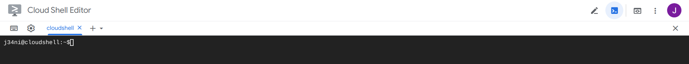

Docker is already available, therefore we can directly pull the latest ESCOMP/CESM-2.2 image from DockerHub:
```
docker pull escomp/cesm-2.2:latest
```
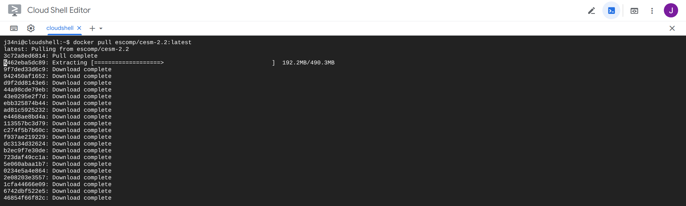

and if everything went well this is what you should get:

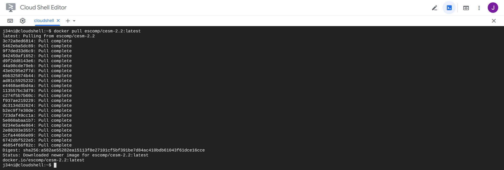

We can now start the container in detached mode:
```
docker run -td escomp/cesm-2.2:latest
```
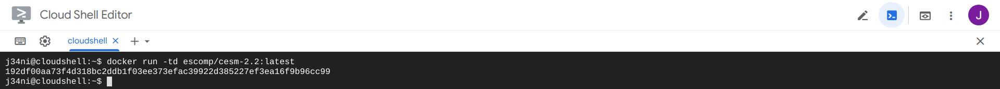
Take note of the UUID long identifier which starts with *192df0aa73*: this string has been randomly generated by 
the Docker daemon.


To start an interactive processe like a bash shell we use *docker exec ... bash* with the first letters of the UUID
(here *-t* is to allocate a pseudo-tty and *-i* to keep STDIN open even if not attached):
```
docker exec -it 192 bash
```
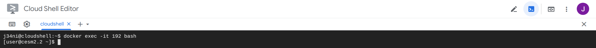
The promp has now changed to **[user@cesm2.2 ~]$** to confirm that we are in the container.

We can now, for example, check the version of the operating system inside the container (it is Centos-8 in this case, 
whereas that was originally Debian in the Google Cloud Shell):
```
cat /etc/os-release
```
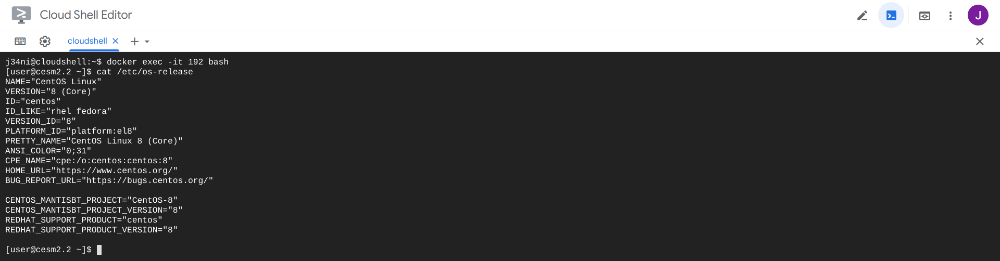

__The container comes with CESM-2.2 and all the software environment necessary to run it, 
including compilers and libraries.__

This particular virtual machine only offers limited resources to effectively run an experiment, therefore we will
only try a simple model configuration 
[Moist baroclinic wave with Kessler microphysics](https://www.cesm.ucar.edu/models/simpler-models/fkessler/index.html) and use a coarse resolution:

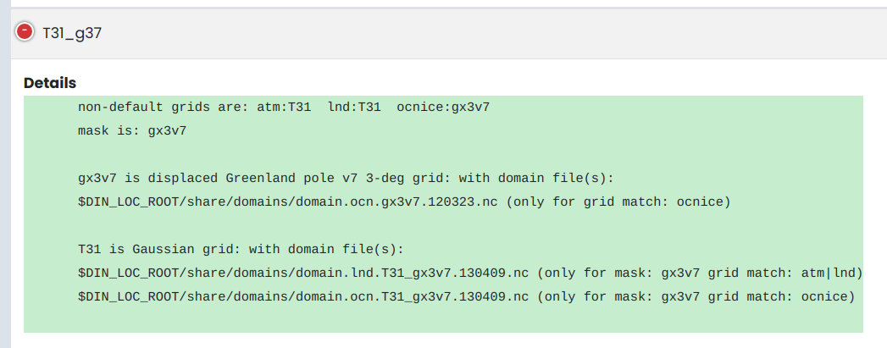

To create a new case:
```
create_newcase --case fkessler --compset FKESSLER --res T31_g37 --run-unsupported
```
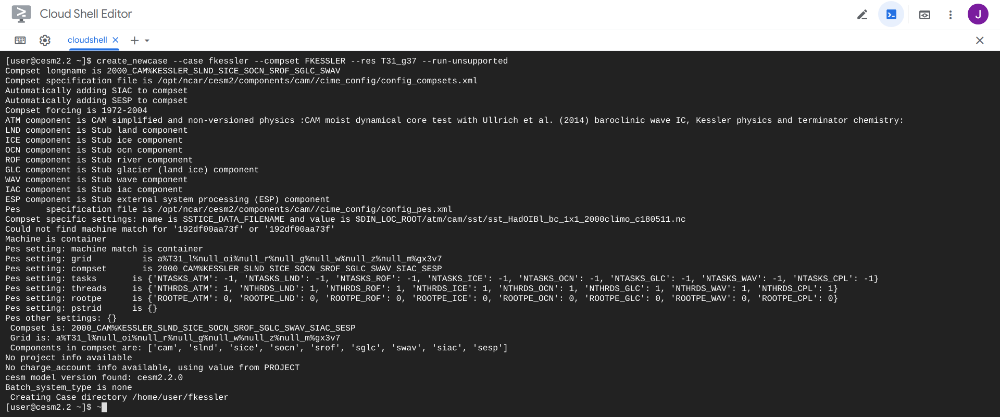

Since there are only 2 processors on this machine the number of tasks has to be decreased (the default is 256), and we will run the simulation for 1 day only (instead of 5 days). 

To do so we go in the case directory and use the *./xmlchange* script:
```
cd /home/user/fkessler
./xmlchange NTASKS=2
./xmlchange STOP_N=1
```
Then set-up, build and submit the case:
```
./case.setup
```
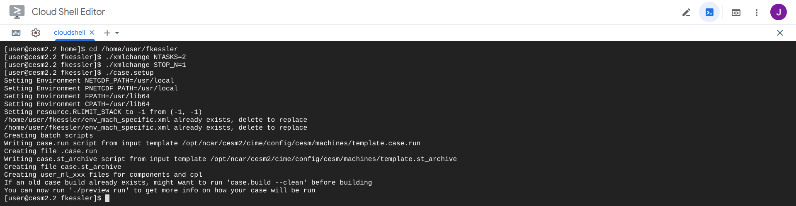
```
./case.build
```
The compilation should take less than 6 minutes and hopefully end with the message "MODEL BUILD HAS FINISHED SUCCESSFULLY".
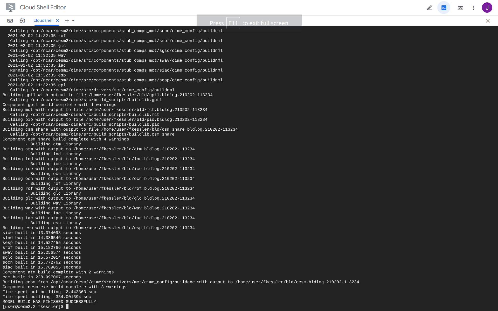
```
./case.submit
```
The missing data is downloaded first, the run begins, finishes after a minute or so and the output files are archived (do not worry about the warning):

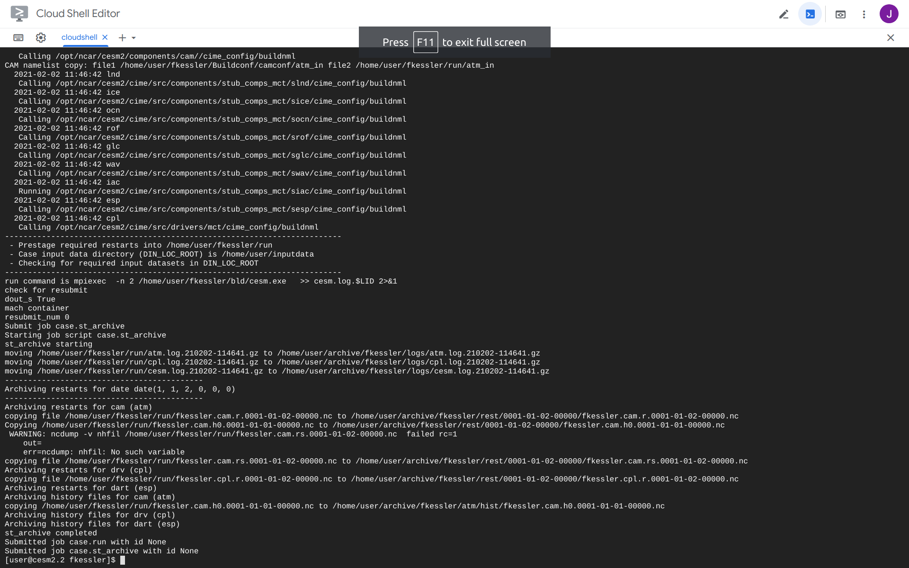

The timing information shows that the model throughput was 8.14 simulated_years/day.
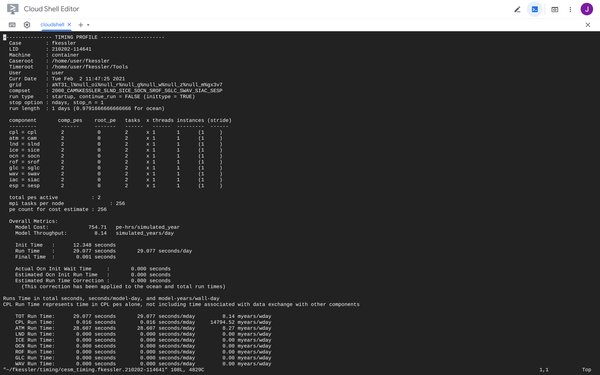
